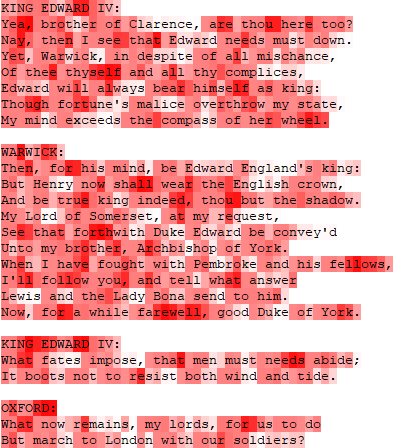
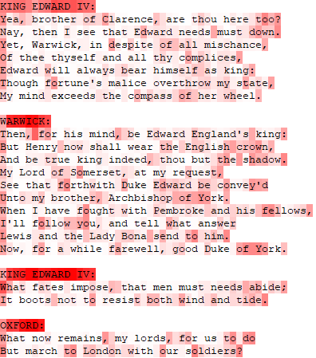
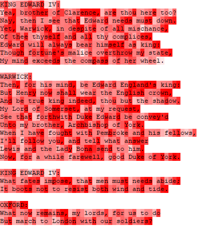
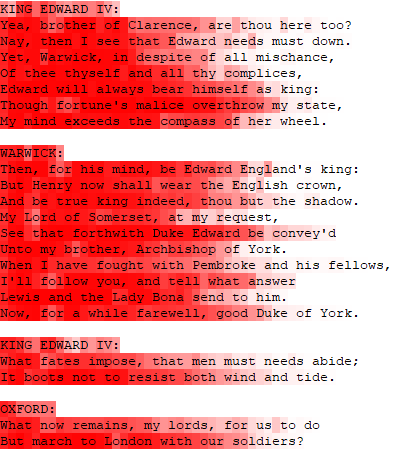
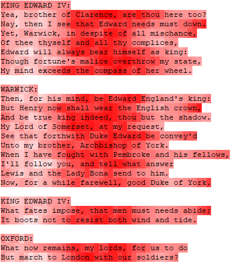
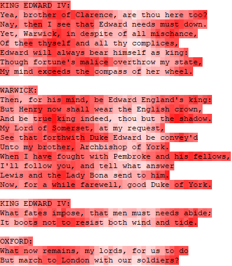

# Generating text with recurrent neural networks
> The project is inspired by [this](http://karpathy.github.io/2015/05/21/rnn-effectiveness/) blog post of Andrej Karpathy.

This repository contains a raw implementation of an LSTM network, trained to generate Shakespeare-like text. No deep learning libraries have been used, the only third-party dependency is numpy.

The model is a double layer LSTM, with 512 units in both layers, followed by a fully connected softmax. It has been trained on a [dataset](https://github.com/karpathy/char-rnn/tree/master/data/tinyshakespeare) containing roughly 1,000,000 characters of sonnets of Shakespeare. 
There are different approaches to this kind of networks; they can operate on word, or on character level. This project implements the latter, processing a single character at a time. To represent a character in a vectorized form we used one-hot encoding. This means that the input vector has the same length as the number of different characters occuring in the text. Each character in the vocabulary gets an index assigned. The vectorized form of a given character is a vector containing zeros everywhere but at its own index, where it has the value 1.
> The mapping from characters to indices can be found in `saves/`. It is important to use the same mapping when sampling as the one used in training time. The directory also contains the weights of the trained network, the training data and the saved optimizer.

During training, all the characters are fed into the network in order, one at each time step. After the current character has been fed in, the network attempts to predict the next character in the sequence. The label at that step is the real next character in the training text. In order to speed up learning, the corpus has been divided into 25 smaller chunks of 44,600 characters, that were processed independently in parallel. Even though the implementation of the network fully utilizes numpy, the training process is still painfully slow, taking roughly 6 hours for a single epoch, so the tiny bit of extra performace gained with the parallelization is of crucial importance. To update the parameters of the network an RMSprop optimizer was used, with `learning rate = 0.001` and `rho = 0.95`. The backpropagation method of choice is Truncated Backpropagation Through Time, with `k1 = k2 = 100`.

## Results
After the network has been trained sufficiently, we can use it to generate new text. This is done by first specifying a "starting string" (usually a single character.), which gets fed into the network, and, since the model is trained to output the next character, we can simply sample from the distribution produced by the softmax layer to obtain the most likely next character. Then we feed this character into the network, and repeat the whole process again.

And now let's look at some actual results. Without training, just relying on the random weight initialization, the generated sample will look something like this:
```
I"Xm&GXVM]9;Pa;(o{2&NPwkb\<QMGu(KrmONut[=,n7Z?RtGg:
=
```
After just a little training, the network starts to understand the concept of words (or at least that the text mostly contains alphabetical characters, separated by spaces). It also occasionally gets short words right.
```
IKrOt denhsy.
Btl toms Rmy, 'or mades rf or loth;
g
E
```
Just train for a little more, and even more word-like structures will emerge.
```
In to?

Tave dh make mouse, diintaI hase't sear.

I
E
```
After just one epoch of training, it starts to adopt the dialogue format: There is a name, followed by a colon, then a newline and a piece of text. It also gets some of the words right.
```
For stend:
Sere is to mant and the rath the pirt, and har the fart the saring,
For her will me as to dor the sill and the word will to the sim and to mant and her ard O sar in the reart on thin me to his and his will ming the ont the ford than a dours with not the all the hint
The gard of mar will and ald dear the marking of the sard
And to the gratt and and lord migher tonder hear to her the wir serand to sterring you mare and and heave her le dow her hard
The parite a dain a dave in the mant the sard to sort.

SABY LO:
And to hat the blord stand and hert and of in the rent to her mad mares me were were wers and best that I the dient not hat your mare marks of the hir sand reris
And our har to de the wind arl parter wind and lis to may of the hards and hes faith and my sord and her
And to pat in to the sind my not to will the lave and here
The fart of your to spart to mar or to dar and a stare and
That the wat the sain and all so be thy sord dough mere har his dent the ford ho
```
The model in this repository has been trained for 7 epochs. And this is what it is capable of:
```
LUCENTIO:
I think it is your wrathing heart to live
That he had loved us to the prince of her best:
If you do seek the way to cross them all:
The are and spoke hath all the stare of learn.

KING HENRY VI:
What is it not a man to be a straitle?

LADY CAPULET:
A cratte your wife, the time of stay as you
That made him from the hand of stand a heart
To swear the parliament of the walls the fall
Of her a cold as he well assure them deliver
That thou hast slaughter thee to me in sud repose,
I would not be so fair a primate to his soldiers.

MENENIUS:
What is your honour, sir, the same and the
Toward her from means that have been a strift a day
and we have standing to a new mad be so strong.

HORTENSIO:
Go to my son! what of the people, but a strange forth
Than the best way the prince is he come to thee.

SEBASTIAN:
What is the matter?
```
Syntactically, there is surprisingly little difference between this sample, and the actual training file. Also almost all the words are legit (since the model samples from the output distribution instead of an argmax, it will occasionally have typos), and the use of the newline character is way more consistent, and more similar to the training text than in the example above. Most of the senteces however make very little sense, and don't really have a clear structure. This would probably get better if trained further, at the time of stopping the training the model was still actively improving.
## Visualizing the activation of individual neurons
To get a better understanding of what exactly is happening within the layers, we can visualize the activations of the hidden neurons, as a function of an input sequence. The following figures illustrate the output of a single neuron, along with the input sequence. The background color of each character corresponds to the activation of the neuron at that time step. A completely white background means an activation of -1, a completely red means an activation of 1.

Most of the neurons are not easily interpretable, and do seemingly random thing, such as this one:



However if we look carefully (and for long enough) we can find a handful of neurons with an interpretable role. There is one that tends to fire inside names:



This one gets increasingly more excited as the end of a word approaches (with varying success):



The activation of this neuron is inversely proportional to the chance of a newline character in the sequence. It is (supposedly) used to trigger an enter after every 40-45 characters.



The same analysis can be done for the first LSTM layer as well. There are however much less neurons with interpretable meaning, presumably because of doing more low-level stuff. A few of them seem to do a kind of positional encoding, producing a sine wave as a function of time steps since the last newline.



Or this one:



There are even more of these kind of patterns, each with a slightly different wavelength and/or slightly shifted.

## The code
This project is self-contained, with the only non-standard dependency being numpy. Most of the files are "library" files, that cannot be run. The files with a name starting with ```_``` are the ones that can be executed.

```_sample.py``` lets you generate text from a pre-trained model. You can specify the path to the saved weights of the model, and to the lookup file (both of which are located in the ```saves/``` folder), the length of the to be generated sequence, and the temperature of the softmax. The temperature is used to divide the logits before entering the softmax, and gives control over the "softness" of the output distribution.   
If the value is really small, that means that the logits will get bigger before entering the softmax, which will result into a "harder" output distribution, with one value being very large, suppressing all the others. Sampling from such a distribution almost equals to doing an argmax over the output. Setting a value close to zero will result into more predicatble text, constantly reusing the same few words. It sometimes even gets stuck in a loop, generating the same words over and over again.  
If the temperature value is large, the logits will get small, and the difference between them will vanish. Setting a huge value will result into an almost uniform output distribution. Networks with high temperature tend to get more creative, use more words and have more variation in their samples, but also make more spelling mistakes. The final sample above has been created with a temperature of ```0.5```.

```_training.py``` lets you train a new model, or resume the training of a saved instance. Training is however strongly advised against, as it takes insanely long.

```_visualize.py``` lets you inspect the activations of different neurons when applied to different sample texts. The analyzed text is loaded from ```saves/sample.txt```.
